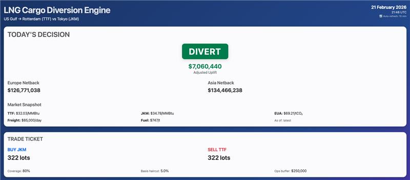
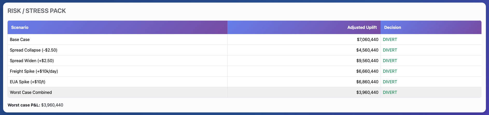
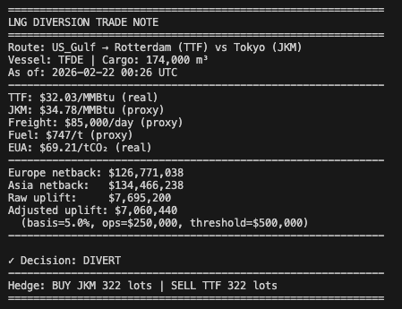

# LNG Cargo Diversion Decision Engine

> **Real-time decision support for LNG cargo routing optimization**  
> Evaluates Europe vs Asia discharge economics with live market data, stress testing, and historical validation

[](https://www.python.org/downloads/)
[](https://opensource.org/licenses/MIT)
[](https://github.com/psf/black)

---

## What This Solves

**The Desk Decision:** You have an LNG cargo leaving the US Gulf Coast. The original plan is to discharge in Europe (Rotterdam, TTF market). But Asia (Tokyo, JKM market) prices might be higher. Should you divert?

This engine answers three critical questions:

1. **Which route is more profitable?** Compare Europe vs Asia netbacks (profit after all costs)
2. **Is the margin large enough to act?** Apply conservative buffers for basis risk and operational uncertainty
3. **What's the trade?** Generate executable hedge instructions (futures lots, price levels)

**Target Users:** Front office LNG traders, risk managers, and operations teams evaluating cargo routing decisions in real-time.

**Output:** A clear DIVERT or KEEP decision with supporting analytics, stress tests, and historical validation.

---

## Decision Rule

The engine calculates the **adjusted uplift** (incremental profit from diverting to Asia) and triggers DIVERT if it exceeds the threshold:

```
Raw Uplift = Asia Netback - Europe Netback

Adjusted Uplift = Raw Uplift × (1 - Basis Haircut) - Ops Buffer

Decision: DIVERT if Adjusted Uplift ≥ Decision Buffer
          KEEP otherwise
```

### Buffer Framework

| Buffer | Default | Purpose |
|--------|---------|----------|
| **Basis Haircut** | 5% | Accounts for basis risk between physical LNG and financial hedges, timing mismatches, and execution slippage |
| **Ops Buffer** | $250k | Covers operational risks: port delays, weather, demurrage, canal wait times |
| **Decision Buffer** | $500k | Minimum profit threshold to justify operational complexity and uncertainty of diversion |

**Example:**
```
Asia Netback:    $134.5M
Europe Netback:  $126.8M
Raw Uplift:      $7.7M

Adjusted Uplift: $7.7M × 0.95 - $250k = $7.06M
Decision:        DIVERT ✓ (exceeds $500k threshold)
```

---

## Inputs

### Market Data (Auto-fetched)

| Data Point | Source | Status |
|------------|--------|--------|
| **TTF** (European gas) | Yahoo Finance (`TTF=F`) | Live (15-min delay) |
| **EUA** (Carbon allowances) | Yahoo Finance (`CO2.L`) | Live (20-min delay) |
| **JKM** (Asian LNG) | TTF + variable premium ($0.50-$3.50) | Proxy* |
| **Freight Rate** | Constant $85k/day | Proxy |
| **Fuel Price** | Constant $747/tonne | Proxy |

**\*JKM Note:** Historical data uses variable premium (seasonal + random walk) to simulate realistic spread dynamics. Live mode uses constant $2.75. Variable premium generated with `tools/add_jkm_variability.py`.

### Configuration Data

Static parameters loaded from CSV files in `data/`:

| File | Content | Examples |
|------|---------|----------|
| `routes.csv` | Port-to-port distances | US Gulf → Rotterdam: 5,000 nm<br>US Gulf → Tokyo: 9,500 nm |
| `vessels.csv` | Vessel specifications | TFDE/MEGI: 174k m³, 19.5 kn, 0.10%/day boil-off |
| `carbon_params.csv` | CO₂ emission factors | 3.114 tCO₂/tonne fuel |
| `config.csv` | Decision parameters | Buffers, haircuts, coverage ratios |
| `benchmark_prices.csv` | Historical prices | 530+ days of TTF, JKM, EUA for backtesting |

---

## Outputs

### 1. Decision & Trade Ticket

**Live evaluation** generates:

- **Decision**: DIVERT or KEEP with adjusted uplift in USD
- **Netbacks**: Europe and Asia profit calculations with detailed cost breakdowns
- **Hedge Instructions**: 
  - Example: `BUY JKM 322 lots @ Market | SELL TTF 322 lots @ Market`
  - Sized at 80% cargo coverage (configurable)
  - 1 lot = 10,000 MMBtu
  - Includes notional values and risk exposure

**Saved to:** `reports/trade_ticket_YYYYMMDD_HHMMSS.json` (when using `--save`)

### 2. Risk Analysis (Stress Testing)

Tests decision robustness under adverse market scenarios:

| Scenario | Shock | Purpose |
|----------|-------|----------|
| Spread Collapse | JKM-TTF narrows by $2.50/MMBtu | Test downside if Asia premium evaporates |
| Spread Widening | JKM-TTF widens by $2.50/MMBtu | Test upside if Asia demand surges |
| Freight Spike | +$10k/day charter cost | Test sensitivity to Baltic rate moves |
| Freight Drop | -$10k/day charter cost | Test if cheaper freight enables diversion |
| Carbon Spike | +$10/tonne EUA | Test EU carbon policy risk |
| Worst Case | All adverse shocks combined | Test decision robustness under stress |

**Output:** Shows if decision flips under stress, worst-case adjusted uplift, scenario-specific P&L

### 3. Rule Validation (Backtest)

Runs decision rule on 530+ days of historical data (Jan 2024 - Feb 2026) to validate trigger frequency and conditional uplift:

**Metrics:**

| Metric | Description | Example Value |
|--------|-------------|---------------|
| **Observation Period** | Days of historical data analyzed | 530 days (Jan 2024 - Feb 2026) |
| **DIVERT Frequency** | % of days when spread wide enough | ~92% (491 days) |
| **KEEP Frequency** | % of days when spread too tight | ~8% (39 days) |
| **Avg Conditional Uplift** | Mean adjusted profit per DIVERT | $4.92M |
| **Total Conditional Uplift** | Cumulative profit from DIVERTs | $2.42B |
| **Min/Max Uplift** | Range of daily adjusted uplifts | $2.8M - $16.2M |

**Equity Curve:** Chart showing cumulative conditional P&L over time with flat periods during KEEP decisions.

**Important Disclaimer:** This is a **rule-behavior validation**, not an investable strategy backtest. It measures trigger frequency and conditional uplift when the rule fires. Actual trading P&L would include:

- Execution slippage and market impact
- Basis risk between financial hedges and physical cargo
- Hedging transaction costs and exchange margin requirements
- Operational uncertainties not fully captured by buffers
- Port logistics, demurrage, and weather routing costs

**Saved to:** 
- `reports/backtest_report_YYYYMMDD_HHMMSS.json` (detailed metrics)
- `reports/equity_curve_YYYYMMDD_HHMMSS.csv` (time series data)
- `reports/backtest_trades_YYYYMMDD_HHMMSS.csv` (trade-level details)

### 4. Dashboard (Web Interface)

Interactive web dashboard consolidating all outputs in a single-page view:

**Features:**
- **Section 1:** Today's decision with live market snapshot (15-20 min delay)
- **Section 2:** Trade ticket with hedge instructions and risk exposure
- **Section 3:** Stress test table showing scenario analysis
- **Section 4:** Rule validation metrics with equity curve chart
- **Section 5:** Analytics visualizations (netback comparison, uplift waterfall)
- **Auto-refresh:** Live sections update every 15 minutes
- **Export:** Download charts as high-resolution PNGs

**Access:** `http://127.0.0.1:8050` after running `.venv/bin/python dashboard.py`

---

## Getting Started

### Prerequisites

- **Python 3.12+** (tested on 3.12.0)
- **pip** package manager
- **Internet connection** for Yahoo Finance API

### Installation

**1. Clone the repository**
```bash
git clone https://github.com/lo-devx/lng-cargo-diversion-engine.git
cd lng-cargo-diversion-engine
```

**2. Create virtual environment**
```bash
python -m venv .venv
source .venv/bin/activate  # macOS/Linux
# .venv\Scripts\activate  # Windows
```

**3. Install dependencies**
```bash
pip install -r requirements.txt
```

**4. Download historical data**
```bash
python tools/download_historical_data.py
```

**5. (Optional) Generate variable JKM premium**
```bash
python tools/add_jkm_variability.py
```

> **Note:** Variable JKM data is pre-loaded in the repository. Step 5 is only needed if you want to regenerate with different parameters.

### Adding JKM Variability
**Note:** The project already includes variable JKM premium data in `data/benchmark_prices.csv`. You only need to run this if you want to regenerate with different parameters.

By default, historical data uses variable premium ($0.50-$3.50) to create realistic spread dynamics:

```bash
python tools/add_jkm_variability.py
```

This modifies `data/benchmark_prices.csv` to add:
- **Seasonal patterns**: Winter premium ~$3.00 (Asian demand), Summer ~$1.25 (shoulder season)
- **Random noise**: ±$0.60 day-to-day volatility
- **Range**: $0.50 to $3.50 premium (bounded to realistic limits)
- **Mean**: ~$2.12 average

Result: Backtest shows:
- ~92% DIVERT rate (491/530 days when spread wide enough)
- ~8% KEEP rate (39/530 days when spread too tight)
- $4.92M average conditional uplift
- Realistic equity curve with flat periods during KEEP decisions

**Live mode** (today's decision) still uses constant $2.75 from `data/config.csv`.

## Usage

### Command Line Interface

#### 1. Live Decision (Today's Market)

```bash
python app.py
```

Fetches current TTF and EUA from Yahoo Finance, calculates decision, prints to console.

**Output:**
- Decision (DIVERT/KEEP) with adjusted uplift
- Market snapshot with data provenance
- Netback comparison (Europe vs Asia)
- Hedge instructions with lot sizing

#### 2. Save Reports

```bash
python app.py --save
```

Same as above, but saves output to `reports/trade_ticket_YYYYMMDD_HHMMSS.json`.

#### 3. Backtest Mode (Historical Validation)

```bash
python app.py --backtest --save
```

Runs decision rule on 530+ days of historical data, displays metrics, saves:
- `reports/backtest_report_YYYYMMDD_HHMMSS.json` (summary statistics)
- `reports/equity_curve_YYYYMMDD_HHMMSS.csv` (time series)
- `reports/backtest_trades_YYYYMMDD_HHMMSS.csv` (trade log)

#### 4. Custom Parameters

```bash
# Change ports or vessel
python app.py --asia-port Singapore --vessel-class MEGI

# Override decision buffers
python app.py --basis 0.03 --ops-buffer 200000 --decision-buffer 600000

# Full custom run with save
python app.py --asia-port Singapore --basis 0.04 --save
```

### Web Dashboard

**Start the dashboard:**
```bash
.venv/bin/python dashboard.py
```

**Access:** Open browser to `http://127.0.0.1:8050`

**Features:**
- **Live data:** Fresh market snapshot on page load
- **Auto-refresh:** Live sections update every 15 minutes
- **Backtest cache:** Historical validation cached at startup for fast loading
- **Single-page layout:** Scroll through all 5 sections
- **Export charts:** Download high-resolution PNGs

**Stop server:** Press `Ctrl+C` in terminal

### Command Line Options

| Option | Description | Default |
|--------|-------------|---------|
| `--load-port` | Load port | US_Gulf |
| `--europe-port` | Europe discharge port | Rotterdam |
| `--asia-port` | Asia discharge port | Tokyo |
| `--vessel-class` | Vessel class (TFDE/MEGI) | TFDE |
| `--cargo-m3` | Cargo capacity in m³ | 174000 |
| `--basis` | Basis haircut 0-1 (e.g., 0.05) | 0.05 |
| `--ops-buffer` | Ops buffer in USD | 250000 |
| `--decision-buffer` | Decision buffer in USD | 500000 |
| `--coverage` | Coverage ratio 0-1 (e.g., 0.80) | 0.80 |
| `--save` | Save results to reports/ | False |
| `--backtest` | Run backtest mode | False |

---

## Project Structure

```
lng-cargo-diversion-engine/
├── app.py                      # CLI entry point (live & backtest modes)
├── dashboard.py                # Web dashboard server
├── requirements.txt            # Python dependencies
├── README.md                   # This file
│
├── data/                       # Configuration and historical data
│   ├── benchmark_prices.csv    # Historical TTF, JKM, EUA prices
│   ├── config.csv              # Decision parameters and buffers
│   ├── routes.csv              # Port-to-port distances
│   ├── vessels.csv             # Vessel specifications
│   ├── carbon_params.csv       # CO₂ emission factors
│   ├── freight_rates.csv       # Freight rate constants
│   └── fuel_prices.csv         # Bunker fuel price constants
│
├── engine/                     # Core calculation modules
│   ├── __init__.py
│   ├── data_loader.py          # Load configuration and static data
│   ├── market_data.py          # Fetch live prices from Yahoo Finance
│   ├── netback.py              # Calculate route economics
│   ├── decision.py             # Apply decision rule and buffers
│   ├── risk.py                 # Stress testing scenarios
│   ├── backtest.py             # Historical validation engine
│   └── reports.py              # Generate trade tickets and reports
│
├── tools/                      # Utility scripts
│   ├── download_historical_data.py  # Fetch TTF/EUA from Yahoo Finance
│   └── add_jkm_variability.py       # Generate variable JKM premium
│
├── reports/                    # Generated output files
│   ├── trade_ticket_*.json     # Live decision trade tickets
│   ├── backtest_report_*.json  # Backtest summary statistics
│   ├── equity_curve_*.csv      # Backtest time series
│   ├── backtest_trades_*.csv   # Trade-level backtest log
│   └── risk_report_*.json      # Stress test results
│
└── docs/                       # Documentation
    ├── formulas.md             # Calculation formulas reference
    └── screenshots/            # Dashboard and CLI screenshots
```

---

## Assumptions & Limitations

### Current Assumptions
1. **JKM Proxy**: Historical data uses variable premium ($0.50-$3.50, avg $2.12) for realistic backtests. Live mode uses constant $2.75. Real JKM requires Platts subscription ($$$).
2. **Freight Proxy**: Constant $85,000/day. Real freight rates (Baltic Exchange LNG indices) require subscription.
3. **Fuel Proxy**: Constant $747/tonne LNG bunker fuel. Real bunker prices require subscription or broker quotes.
4. **Vessel Specs are Representative**: TFDE/MEGI parameters based on typical newbuild specs. Actual desk would use vessel-specific fuel curves, charter party terms, and seasonal derating factors.
5. **Boil-off**: Fixed 0.10%/day. Actual boil-off varies by vessel age, insulation, ambient conditions.
6. **Voyage Time**: Based on great-circle distance and constant speed. Ignores weather routing, canal delays, port congestion.
7. **No Canal Costs**: Suez/Panama canal fees not explicitly modeled (can be added to ops buffer).
8. **Single Cargo Model**: One-way laden voyage. Doesn't optimize ballast leg or round-trip economics.
9. **Static Vessel Selection**: Doesn't optimize vessel choice based on current market conditions.

### Known Limitations
- **No weather routing**: Uses straight-line distance, not actual navigation paths
- **No port logistics**: Assumes immediate discharge, no berth availability constraints
- **No contract basis risk**: Assumes perfect hedge execution at settlement prices
- **No credit/margin modeling**: Doesn't account for exchange margin requirements or credit lines
- **No multi-cargo optimization**: Evaluates single cargo in isolation

### Operational Uncertainties (Covered by Buffers)
- Laycan slippage (loading date delays)
- Terminal delays and demurrage
- Weather deviations
- Bunkering strategy variations
- Port congestion and wait times

**These are handled via the $250k Ops Buffer rather than explicit scheduling models.**

---

## How to Swap in Licensed Feeds

When you have access to professional data feeds, replace proxies with real data:

### Option 1: Swap Yahoo Finance for Bloomberg/Refinitiv
In `engine/market_data.py`:
```python
# Current: Yahoo Finance
ttf = _last_close("TTF=F")

# Replace with Bloomberg API
import blpapi
ttf = fetch_bloomberg("TTF Comdty", "PX_LAST")
```

### Option 2: Add Real JKM from Platts
In `engine/market_data.py`:
```python
# Current: Proxy
jkm = ttf + 2.75

# Replace with Platts API
jkm = fetch_platts_jkm()  # Your Platts integration
prov["JKM"] = "real"
```

### Option 3: Add Real Freight from Baltic Exchange
In `data/config.csv` or via API:
```python
# Current: Constant
freight = 85000

# Replace with Baltic LNG7t index
freight = fetch_baltic_lng7t()  # Your Baltic integration
```

### Option 4: Use Real Bunker Prices
```python
# Current: Constant
fuel = 747

# Replace with bunker broker feed
fuel = fetch_bunker_prices("VLSFO", "Singapore")
```

**Data Contracts:** All modules expect prices in standard units (USD/MMBtu, USD/day, USD/tonne). No code changes needed beyond swapping the data fetch function.

---

## Screenshots

### 1. Dashboard - Today's Decision & Trade Ticket

*Shows live decision (DIVERT/KEEP), adjusted uplift, netback comparison, market snapshot with provenance, and hedge instructions*

### 2. Dashboard - Risk Analysis (Stress Pack)

*Stress test scenarios showing decision robustness under spread collapse, freight spikes, and carbon shocks*

### 3. Dashboard - Historical Validation (Backtest)

*Performance metrics (hit rate, Sharpe ratio, total uplift) and equity curve from 530+ days of historical data*

### 4. CLI - Trade Note Output


*Command-line output showing decision with all calculations and hedge sizing*

---

## Contributing

Contributions are welcome! Please follow these guidelines:

1. **Fork** the repository
2. **Create** a feature branch (`git checkout -b feature/improvement`)
3. **Commit** your changes (`git commit -am 'Add new feature'`)
4. **Push** to the branch (`git push origin feature/improvement`)
5. **Open** a Pull Request

### Development Setup

```bash
# Install dev dependencies
pip install -r requirements.txt

# Run tests (if available)
pytest tests/

# Format code
black .
```

---

## License

This project is licensed under the MIT License - see the [LICENSE](LICENSE) file for details.

---

## Contact

**Repository:** [github.com/lo-devx/lng-cargo-diversion-engine](https://github.com/lo-devx/lng-cargo-diversion-engine)

**Issues:** [github.com/lo-devx/lng-cargo-diversion-engine/issues](https://github.com/lo-devx/lng-cargo-diversion-engine/issues)

---

## Acknowledgments

- **Yahoo Finance** for TTF and EUA market data access
- **Dash/Plotly** for dashboard framework
- **LNG shipping community** for vessel specifications and operational insights

---
